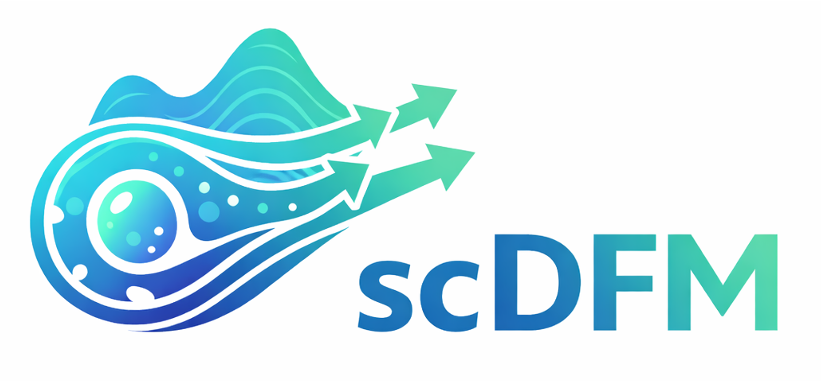

<p align="center">
  
</p>

# scDFM: Distributional Flow Matching for Robust Single-Cell Perturbation Prediction

[](https://openreview.net/forum?id=QSGanMEcUV)
[](https://github.com/AI4Science-WestlakeU/scDFM)
[](LICENSE)


Official repo for the paper [scDFM](URL), ICLR 2026. <br />
Chenglei Yu<sup>∗1,2</sup>, [Chuanrui Wang](https://wang-cr.github.io/)<sup>∗1</sup>, Bangyan Liao<sup>∗1,2</sup> & [Tailin Wu](https://tailin.org/)<sup>†1</sup>.<br />

<sup>1</sup>School of Engineering, Westlake University; 
<sup>2</sup>Zhejaing University;

</sup>*</sup>Equal contribution, </sup>†</sup>Corresponding authors

----

## Overview 
We propose a novel distributional flow matching framework (scDFM) for robust single-cell perturbation prediction, which models the full distribution of perturbed cellular expression profiles conditioned on control states, thereby overcoming limitations of existing methods that rely on cell-level correspondences and fail to capture population-level transcriptional shifts.

Framework of paper:

<a href="url"></a>

## Install dependencies 
```
conda env create -f environment.yml
```

##  ⏬ Dataset download
Put dataset into data file:

- [Norman](https://figshare.com/articles/dataset/Norman_et_al_2019_Science_labeled_Perturb-seq_data/24688110?utm_source=chatgpt.com&file=43390776)
- [Combosciplex subset of sciplex v3](https://figshare.com/articles/dataset/combosciplex/25062230?file=44229635)


## 📥 Training

An example on additive task.
```bash
bash run.sh
```

## 🫡 Citation

If you find our work and/or our code useful, please cite us via:

```bibtex
comming soon
```

## 📚 Related Resources

- AI for Scientific Simulation and Discovery Lab: https://github.com/AI4Science-WestlakeU